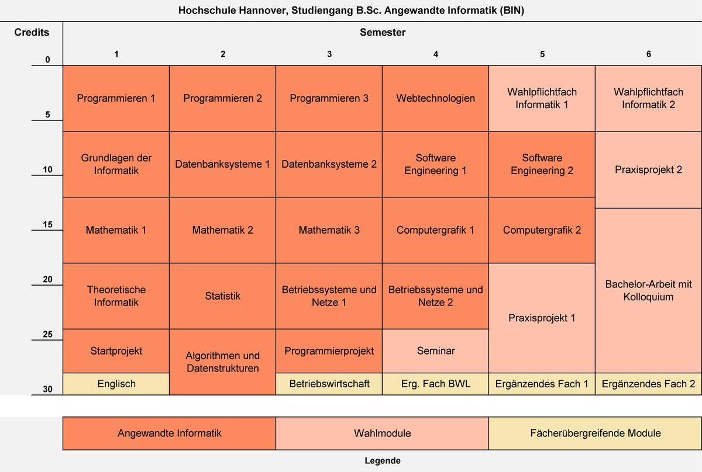

# Studium Ordner

In dem Ordner findet man für alle Fächer die ich in meinem Stuidum belegt habe Zusammenfassungen und die Lösungen der Übungen.

## Angewandte Informatik (BIN)

1. Kurzübersicht über das Studium
    ```
    Abchluss:       Bachelor of Science (B.Sc.)
    Fächergruppe:   Informatik, MINT
    Vertiefungen / Studienschwerpunkte: Software Engineering und Informationssysteme, 
                                        Betriebssysteme und Netzwerke, 
                                        Computergrafik und technische Anwendungen
    ```
    ### Studieninhalte - Angewandte Informatik (BIN)

    
